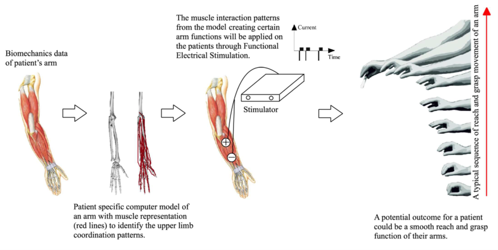

## About this project

The goal of this project is to improve the independence of people with arm paralysis by enabling functional movement using electrical muscle stimulation. Functional Electrical Stimulation (FES) is an assistive and rehabilitation technology whereby low-level electrical signals are used to induce muscle contraction where voluntary control has been lost. Such muscle contractions can strengthen the muscle, load the bones, or produce functional movement in people with paralysis.

In the lower limb, FES technology is used to prevent foot drop during gait in post-stroke hemiplegia. In the upper limb, FES is much less widely used due to the highly selective nature of the movements that users want to perform, as well as the significant variability in motor deficits that exist in people with spinal injuries. This makes the control of any stimulation system very challenging.

In this EPSRC-funded research project, we are working with clinical engineers and spinal injuries specialists to develop efficient methods for personalising an FES system to allow people with high-level spinal cord injuries to control their own arm movements. Biomechanical models, customised to represent the functional limitations due to an injury, are used to predict the effects of electrical stimulation on the paralysed arm. In this way, we can optimise system set up and control (which muscles to stimulate and when) to achieve a desired set of tasks for an individual to help them regain their independence.

## Publications and presentations

- Readioff, Rosti, Zaha Kamran Siddiqui, Caroline Stewart, Louisa Fulbrook, Rory J. O’Connor, and Edward K. Chadwick. 2021. ‘[Use and Evaluation of Assistive Technologies for Upper Limb Function in Tetraplegia](https://www.tandfonline.com/doi/full/10.1080/10790268.2021.1878342)’. The Journal of Spinal Cord Medicine 0 (0): 1–12. https://doi.org/10.1080/10790268.2021.1878342.
- Rosti Readioff, Dimitra Blana, Ed Chadwick: [Transforming the lives of people with tetraplegia](https://www.researchgate.net/publication/332298568_Transforming_the_lives_of_tetraplegics), poster presentation at the Women in Engineering Society Centenary Conference, 1019.

A brief introduction to the project from Dr Ed Chadwick:

<iframe src="https://player.vimeo.com/video/552314375?badge=0&amp;autopause=0&amp;player_id=0&amp;app_id=58479" frameborder="0" allow="autoplay; fullscreen; picture-in-picture" allowfullscreen style="position:absolute;top:0;left:0;width:100%;height:100%;" title="Personalised FES for people with spinal injuries"></iframe>

## Contact

Contact [Dr Ed Chadwick](https://www.abdn.ac.uk/engineering/people/profiles/edward.chadwick) for more information.

## Acknowledgements

This project is led by the [University of Aberdeen Biomechanical Engineering](https://www.abdn.ac.uk/engineering/research/applied-dynamics-124.php) group, with the collaboration of the [Robert Jones and Agnes Hunt Orthopaedic Hospital](https://www.rjah.nhs.uk/orlau), [Keele University](https://www.keele.ac.uk/pharmacy-bioengineering/research/healthcaretechnologies/rehabilitation/) and the [University of Leeds](https://medicinehealth.leeds.ac.uk/homepage/158/leeds_institute_of_rheumatic_and_musculoskeletal_medicine). The project is funded by a grant from the [Engineering and Physical Sciences Research Council](https://epsrc.ukri.org/).
